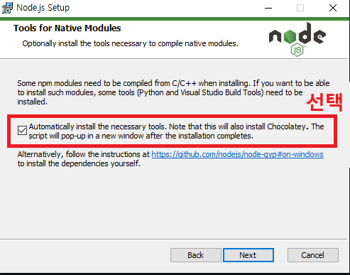

## 설치부터 환경 설정

### NodeJS_설치

1. [Node.js 설치](https://nodejs.org/, "node.js install link") 에 접속하여 Recommended For Most Users (강의로 사용한 버전 : 14.16.0 LTS 버전) 설치 

2. 설치 중 체크 사항 확인.  
</img> 

### 작업 환경 만들기 (Visual Studio Code 사용)

1. [Visual Studio Code 설치](https://code.visualstudio.com/, "vscode install link") 에 접속하여 Visual Studio Code 다운로드 및 설치.
